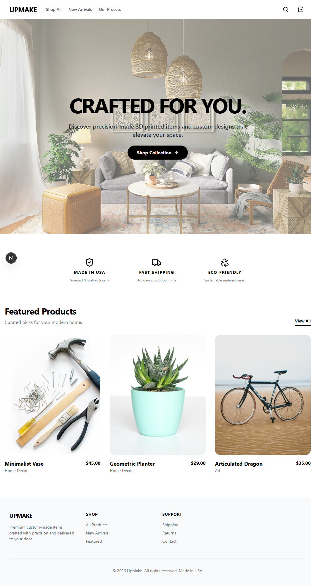
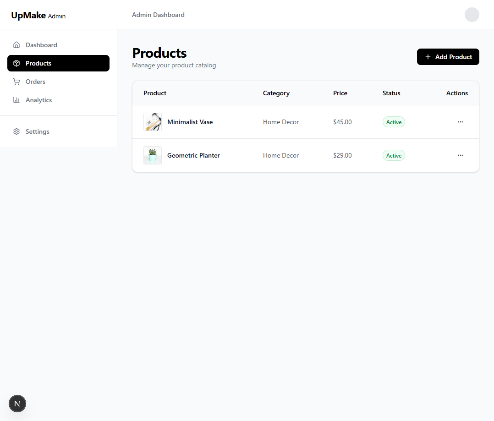

# UpMake - Premium Custom E-commerce Platform

UpMake is a minimalist, high-end e-commerce platform built for custom precision items. It features a modern customer storefront and a robust administrative dashboard for managing the entire product lifecycle.

## 🚀 Tech Stack

- **Framework:** [Next.js 16 (App Router)](https://nextjs.org/)
- **Styling:** [Tailwind CSS v4](https://tailwindcss.com/)
- **State Management:** [Zustand](https://github.com/pmndrs/zustand)
- **Database/ORM:** [Prisma 7](https://www.prisma.io/) with Supabase (PostgreSQL)
- **Payments:** [Stripe](https://stripe.com/)
- **Icons:** [Lucide React](https://lucide.dev/)

---

## 🛍️ Storefront Features

### 🏠 Homepage
*Minimalist hero section with featured collections.*


---

## 🛠️ Admin Dashboard Usage

The Admin Dashboard is located at `/admin`.

### 📦 Product Management
*Robust form for media uploads and variant configuration.*


---

## 🏗️ Getting Started

### 1. Environment Setup
Create a `.env` file in the root:

```env
# Supabase
DATABASE_URL="your-postgresql-url"
DIRECT_URL="your-direct-postgresql-url"

# Stripe
STRIPE_SECRET_KEY="your-sk-test"
NEXT_PUBLIC_STRIPE_PUBLISHABLE_KEY="your-pk-test"

# App
NEXT_PUBLIC_APP_URL="http://localhost:3000"
```

### 2. Installation
```bash
npm install
```

### 3. Database Initialization
```bash
npx prisma generate
# To push schema to your DB:
npx prisma db push
```

### 4. Run Development Server
```bash
npm run dev
```

---

## 📊 Database Schema (Prisma)

- **Product:** Core item data (name, description, base price).
- **ProductVariant:** Option-specific data (name, value, price adjustment).
- **Order:** Customer order tracking (email, total, status).
- **OrderItem:** Snapshots of products and variants purchased.